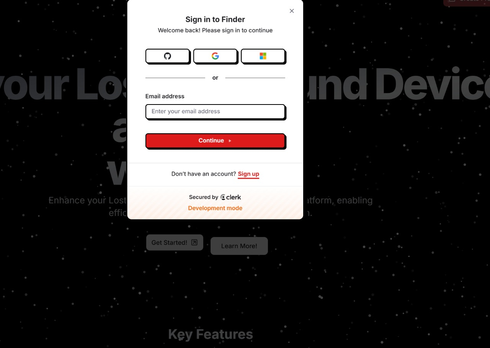
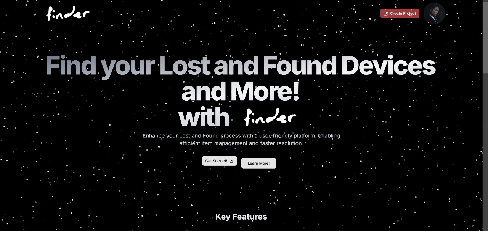
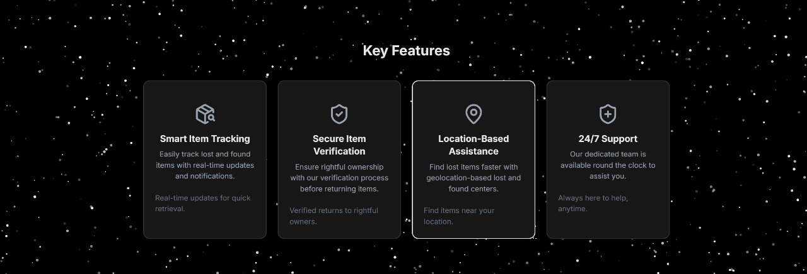

# Finder

## 🔍 About Finder
Finder is a user-friendly platform designed specifically for college students to manage lost and found items efficiently. The application streamlines the process of reconnecting students with their lost belongings through a simple yet powerful interface.

### Key Features
- **Item Reporting**: Easily report lost items or items you've found
- **User-Friendly Interface**: Intuitive platform enabling efficient item management
- **Secure Authentication**: Protected user accounts and data
- **Quick Resolution**: Connect item owners with finders faster
- **Campus-Focused**: Tailored for college campus communities

## 📱 Screenshots

### Login Screen

### Landing Page

### FAQ Section

### Features

## 🛠️ Technologies & Tools

Finder is built using modern web technologies:

- **Frontend**:
  - [Next.js](https://nextjs.org/) - React framework for server-rendered applications
  - [React DOM](https://reactjs.org/) - Component-based UI development
  - [shadcn/ui](https://ui.shadcn.com/) - High-quality UI components

- **Authentication**:
  - [Clerk](https://clerk.dev/) - Complete user management and authentication

- **Database**:
  - [Prisma](https://www.prisma.io/) - Next-generation ORM for Node.js and TypeScript
  - [Neon DB](https://neon.tech/) - fully managed, serverless, and open-source PostgreSQL database platform designed for modern applications

Made with ❤️ for college students
